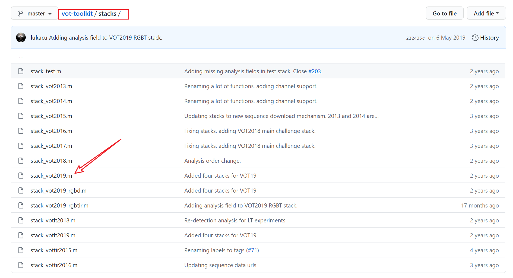
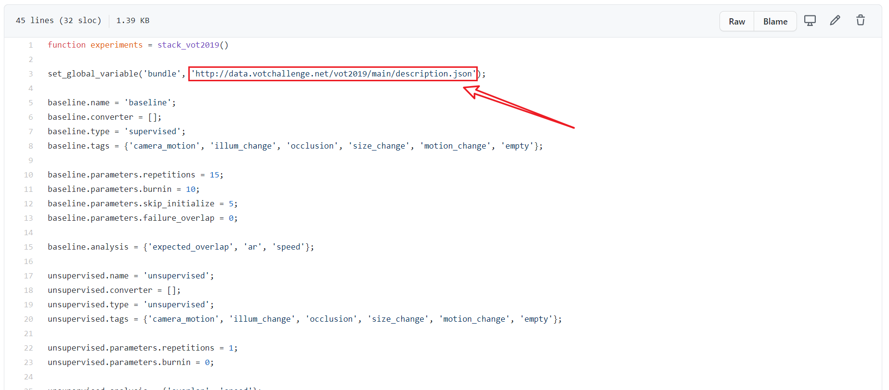
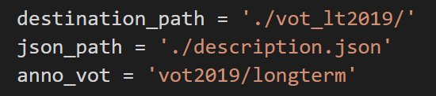
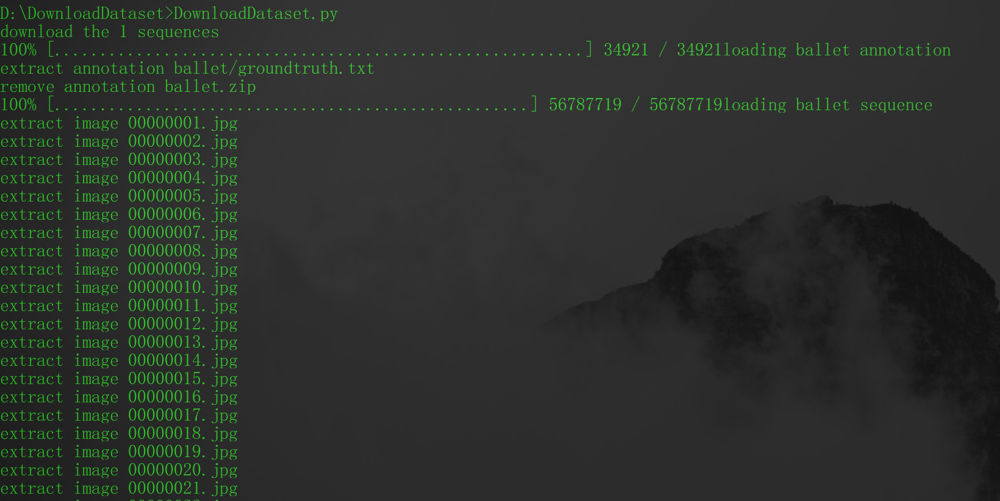

# VOT-Dataset-Download
在做目标跟踪时最常用到的数据集就是VOT数据集了，但是官网给出的下载方法太麻烦了，而且不能批量下载，所以就写了一个自动化下载的Python脚本，使用方法如下：
1. 首先从[vot-toolkit-github](https://github.com/votchallenge/vot-toolkit)下载 json 文件，根据自己要下载的数据集名称到vot-toolkit项目中打开stacks文件下下找到对应的```.m```文件，以VOT2019为例，打开```stack_vot2019.m```文件。

在文件中第三行可以看到一个json文件的url，这就是我们需要的json文件，可以使用```wget```命令或者在浏览器中下载这个json文件。

2. 配置下载脚本。打开DownloadDataset.py配置以下三个参数：

   - destination_path：下载的文件保存的路径；
   - json_path：刚下载的json文件存放的路径；
   - anno_vot：根据不同的数据集有不同的配置，具体参见后文的表1.
3. 开始下载。运行DownloadDataset.py文件，下载就会自动开始，直到下载完成。


**表1：**    
| 数据集 | anno_vot值 |
| ----- | -----|
| VOT2019| vot2019 |
| VOT_LT2019 | vot2019/longterm |
| VOT-RGBTIR2019 | vot2019/rgbtir/meta |
| VOT2018| vot2018 |
| VOT_LT2018 | vot2018/longterm |
